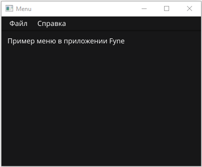
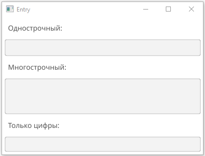
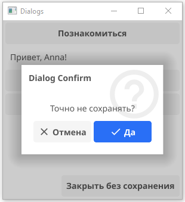
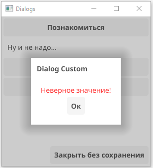
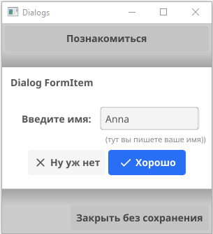
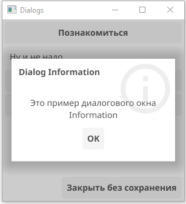

## Заметки по GO Fyne

* Часто используемые элементы Fyne.
* Особенности перевода на русский.
* Разница в похожих свойствах.

### Меню 

После создания меню, автоматически добавляется подменю "Quit", которое постоянно приходится переименовывать в "Выход" (если прога на русском языке).



Мой пример: [my menu example](https://github.com/annettalekto/sandbox_go_fyne/blob/main/widgets/menu.go).

### Entry – поле ввода



Мой пример: [my entry example](https://github.com/annettalekto/sandbox_go_fyne/blob/main/widgets/entry.go).

Полезное свойство Entry — **Wrapping**. При создании элемента `Wrapping = TextTruncate`, это самый адекватный вариант для однострочного виджета, так что можно вообще ничего не прописывать. 

Но есть еще варианты.

**Entry.Wrapping:**

- `TextTruncate` — (значение по умолчанию), если виджет заполняется больше, чем его ширина, то появляется вертикальная полоса прокрутки (удобно для элемента с фиксированным размером). 

- `TextWrapOff` — если заполнить больше ширины виджета, то окно проги разъезжается! Интересно зачем это...

- `TextWrapBreak` — для мультистрочного виджета.

- `TextWrapWord` — для мультистрочного виджета.

**MultiLineEntry.Wrapping:**

- `TextTruncate` — (значение по умолчанию), если виджет заполняется больше своей ширины появляется вертикальная полоса прокрутки и если строк больше чем его длинна, появляется горизонтальная полоса прокрутки.

- `TextWrapOff`  — форма разъезжается! и в ширину и длину при вводе длинных строк ¯\\_(ツ)_/¯.

- `TextWrapBreak`  — если виджет заполняется больше ширины, то (вместо горизонтальной полосы прокрутки) все что не уместилось в одну строчку, переносится на другую строку (часто посередине слова). Вертикальная полоса прокрутки есть.

- `TextWrapWord`  —  тоже с переносом на новую строку, но по словам, не обрывая на полуслове. Самый удобный вариант для редактора. Вертикальная полоса прокрутки есть.

Для многострочных так же можно указать сколько строк будет изначально **SetMinRowsVisible**:

`eMylty.SetMinRowsVisible(5)`

**Еще пара полей:**

Можно немного поменять стиль:

**Entry.TextStyle**: **Bold**, *Italic*, `Monospace`. А вот размер текста не устанавливается...

Смотрим, что нам ввели в поле ввода:

**Entry.OnChanged** — вызвывается на каждый введенный в поле ввода символ.

**Entry.OnSubmitted** — вызывается когда ввели всю строку и нажали *Enter* для подтверждения (в многострочном MultyLineEntry по окончанию ввода *Shift + Enter*).

```go
// вызывается на каждый символ, но s - все введенное
eMylty.OnChanged = func(s string) {
	fmt.Println("OnChanged: " + s)
}
eMylty.OnSubmitted = func(s string) {
	fmt.Println("OnSubmitted: " + s) // shift + enter
}
```

Можно на нужный элемент установить курсор (или снять) **Entry.FocusGained()**, только я не знаю зачем, т.к. строка не вводится в этом элементе (хотя курсор стоит там, мигает) до тех пор, пока не ткнешь туды мышкой и только после этого строка вводится нормально.

### Расширение базового типа

Стандартные виджеты обеспечивают минимальную функциональность, предполагается расширение базового типа для добавления ему нужных свойств. 

За основу берется виджет `widget.BaseWidget` и с помощью `ExtendBaseWidget` получаем доступ к его полям.

```go
type numericalEntry struct {
    widget.Entry
}

// создаем функцию конструктор на основе базового типа 
func newNumericalEntry() *numericalEntry {
    entry := &numericalEntry{}
    entry.ExtendBaseWidget(entry)
    return entry
}
```

Теперь можем внести дополнения к стандартным методам.

Полное описание:  [Extending Widgets](https://developer.fyne.io/extend/extending-widgets).

Полное описание: [Numerical-entry](https://developer.fyne.io/extend/numerical-entry).

### Диалоговые окна

- **Confirm** — диалоговое окно с выбором "Да/Нет".
  
  

- **Custom** — диалоговое окно с возможностью добавить свой элемент `CanvasObject` (круг метку, цветной текст).
  
  

- **Form** — позволяет добавить свой widget (даже несколько) в диалоговое окно. Можно использовать подсказку (поле hint), но работает она совсем не так как ожидалось (просто текст ниже widget).
  
  

- **Information** — обычное окно с информацией и кнопкой.
  
  

В диалоговых окнах GO Fyne изменить название кнопок (стандартное ok) на любое другое значение можно через методы **SetDismissText** и **SetConfirmText** (если нет этого поля при создании диалога).

Мои примеры: [my dialog example](https://github.com/annettalekto/sandbox_go_fyne/blob/main/widgets/dialog.go).

Нормальное описание: [Dialog List | Develop using Fyne](https://developer.fyne.io/explore/dialogs).

### Связь объекта с переменной (bindable value)

Иногда, если состояние объекта зависит только от одной переменной, удобно привязать объект к этой переменной. При изменении переменной объект будет изменятся автоматически (bindable value доступны от версии Fyne 2.0).

Описание: [fyne: bindable value](https://developer.fyne.io/binding/).

Например, если виджет label отображает только одну строковую переменную (которая изменяется где-то в других местах проги), можно привязать строку к виджету. Переменная должна быть специально типа bindable string:

```go
boundString := binding.NewString()
```

 привязать можно:

- при создании объекта используя функцию New...**WithData()**.
  
  ```go
  label := widget.NewLabelWithData(boundString)
  ```

- с помощью метода **Bind()**, если label создан как обычно.
  
  ```go
  label.Bind(boundString)  
  ```

Предусмотрены методы связать **Bind(str)** и отвязать **Unbind()**. 

Теперь любое изменение переменной автоматически отобразится в `label`. Не нужно дополнительно передавать строку в виджет `label.SetText()`, делать обновление label.Refresh(), можно даже не хранить ссылку на объект. Для взаимодействия с переменной предусмотрены методы str.**Set()**, str.**Get()** и str.**Reload()**.

Мой пример: [bindable value example](https://github.com/annettalekto/sandbox_go_fyne/blob/main/widgets/bind.go).

### ProgressBar

Индикатор выполнения ProgressBar создается буквально в две строки:

```go
    pb1 := widget.NewProgressBar()
    // pb1.Min = 0 (default 0.0)
    // pb1.Max = 10 (default 1.0)
    pb1.Value = 0.5
```

Индикатор заполняется от значения **Min** до **Max** (0 - 1.0 по умолчанию) на значение **Value**, которое и нужно постепенно менять. Все значения доступны к изменению в любой момент после создания индикатора. Но лучше добавлять обновление после изменения границ `pb.Refresh()`.


Если значение **Max** зависит от динамически изменяющихся этапов и в какой-то момент их становиться 0, то **Max** = 0 и **Value**=0 приводят к неверному отображению процента на индикаторе. Можно **Max** установить как очень маленькое число (но больше 0, например, 0.1) и ошибки не будет. Но когда задачи появятся и значение **Max** снова будет больше 0, например 5, и значение **Value**, например, прибавиться на 2 (+ 2 выполненные задачи), то индикатор покажет значение процента на 2.1 из 5. Для того чтобы 0.1 не отображалось можно установить **Min** = 1, теперь каждый шаг индикатора не менее 1.

```go
done := binding.NewFloat()
done.Set(0.1)
pb2 := widget.NewProgressBarWithData(done)
pb2.Max = 0.1
```

Можно создать индикатор отображения сразу связанный с переменной binding float. Для заполнения индикатора нужно изменять только эту переменную, поле **Value** вообще не нужно трогать. 

Можно создать **Infinite** индикатор отображения. Это отдельный индикатор, а не свойство основного. Небольшая полоска бесконечно двигается с права на лево по индикатору. Зачем это нужно я не знаю.

```go
pb21 := widget.NewProgressBarInfinite()
```

Мой пример: [my progressbar example](https://github.com/annettalekto/sandbox_go_fyne/blob/main/widgets/progressbar.go).

Полное описание: [ProgressBar](https://developer.fyne.io/widget/progressbar).
