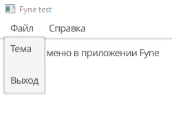
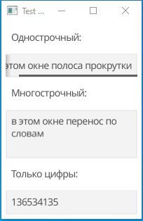
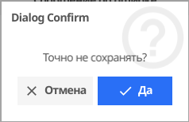
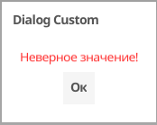
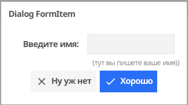
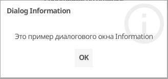

## Заметки по GO Fyne

Часто используемые элементы Fyne. 

### Меню

После создания меню, автоматически добавляется подменю "Quit", которое постоянно приходится переименовывать в "Выход" если прога на русском языке.

[my menu example](https://github.com/annettalekto/sandbox_go_fyne/tree/main/menu)

### Entry – окно ввода

[my entry example](https://github.com/annettalekto/sandbox_go_fyne/tree/main/entry)

Полезное свойство Entry – **Wrapping**. При создании элемента Wrapping = TextTruncate, он самы адекватный для однострочного виджета, так что можно вообще ничего не прописывать. Но есть еще парочка.

**Entry.Wrapping:**

- TextTruncate – если виджет заполненяется больше, чем его ширина, то появляется вертикальная полоса прокрутки. Прям ок, редко нужно что-то другое.

- TextWrapOff – если заполнить больше ширины виджета, то окно проги разъезжается! Тупо выглядит. Интересно зачем это...

- TextWrapBreak – для мультистрочного виджета (тут просто прокрутка).

- TextWrapWord – для мультистрочного виджета (тут просто прокрутка).

**MultiLineEntry.Wrapping:**

- TextTruncate – если виджет заполняется больше своей ширины появляется вертикальная полоса прокрутки, если строк больше чем его длинна, появляется горизонтальная полоса прокрутки.

- TextWrapOff  – окно проги разъезжается! в ширину и длинну при вводе строк ¯\_(ツ)_/¯.

- TextWrapBreak  – если виджет заполняется больше ширины, то (вместо горизонтальной полосы прокрутки) все что не уместилось в одну строчку, переносится на другую (по стредине слова). Вертикальная полоса  прокрутки есть.

- TextWrapWord  –  тоже с переносом на новую строку, того что не уместилось, но по словам, не обывая на полуслове. Самый удобный вариант для редактора. Вертикальная полоса прокрутки есть.

### Диалоговые окна

- **Confirm** – диалоговое окно с выбором "Да/Нет".
  
  

- **Custom** – диалоговое окно с возможностью добавить свой элемент CanvasObject (круг метку, цветной текст).
  
  

- **Form** – позволяет добавить свой widget (даже несколько) в диалоговое окно. Можно использовать подсказку (поле hint), но работает она совсем не так как ожидалось (просто текст ниже widget).
  
  

- **Information** – обычное окно с информацией и кнопкой.
  
  

В диалоговых окнах GO Fyne изменить название кнопок (стандартное ok) на любое другое значение можно через методы **SetDismissText** и **SetConfirmText** (если нет этого поля при создании диалога).

мои примеры: [my dialog example](https://github.com/annettalekto/sandbox_go_fyne/tree/main/dialog)

нормальное описание: [Dialog List | Develop using Fyne](https://developer.fyne.io/explore/dialogs)
